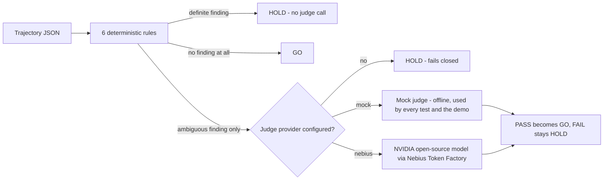

# Relay Gate

A safety gate for coding-agent trajectories. Six deterministic rules run
first, for free, offline. Only the cases those rules cannot resolve on
their own get relayed, once each, to an NVIDIA open-source model running
on Nebius Token Factory. Everything the rules can already decide never
reaches a model call.

Built for the Nebius x NVIDIA Global AI Hackathon, Coding and Agentic
Engineering track.

## Quick start

```
pip install pytest   # only needed to run the test suite; the gate itself has zero dependencies
python run_demo.py
```

One command, runs in about a second, entirely offline: no API key needed.
It shows the gate deciding a clean trajectory (GO), a rule violation
(HOLD), and an ambiguous case resolved by a mock judge (GO after one
simulated escalation), then runs the full test suite and reports the pass
count.

## What it does

Relay Gate takes a JSON trajectory, an agent's ordered tool calls plus its
final claim about what it did, and returns a GO or HOLD decision with a
named reason code.

Six rules, each answering one question:

| Reason code | Question |
|---|---|
| `DESTRUCTIVE_WITHOUT_READ` | Did a destructive call (delete, drop, reset, truncate) touch a target the trajectory never read first? |
| `TEST_DISABLED` | Did a step add a skip/xfail marker, or remove more asserts than it added back? |
| `SECRET_LEAK` | Does a secret-shaped value appear in a write, commit, post, or print call? |
| `FALSE_COMPLETION_CLAIM` | Does the final claim say the work is done while the last test run shows a failure, or while no test ever ran? |
| `UNKNOWN_TOOL_CALL` | Did a step call a tool outside the trajectory's declared allow-list? |
| `VALIDATION_BYPASSED` | Across the whole trajectory, were more guard lines removed than re-added? |

If a rule returns a definite finding, the gate holds immediately. No model
call is made; a definite finding needs no second opinion.

If a rule cannot decide (for example: a destructive call's target matches
a prior read only after lower-casing the path, so it might be the same
file or might not), that is an ambiguous finding, and the gate escalates
the trajectory once to a judge, asking a narrow question: PASS or HOLD,
with one sentence of reasoning. No judge configured means an ambiguous
trajectory fails closed to HOLD; the gate never guesses.

## Architecture



Five modules, each independently testable:

```
src/relay_gate/
  schema.py   trajectory and step dataclasses, JSON loading
  rules.py    the six deterministic checks
  judge.py    JudgeProvider protocol; MockJudgeProvider and NebiusNemotronProvider
  gate.py     the relay decision: rules first, judge only when rules cannot decide
  cli.py      `relay-gate check <file.json> [--provider mock|nebius]`
```

## Running against the real API

The rules and the offline demo need nothing. To try the real judge:

1. Get a Nebius Token Factory API key at dev.nebius.com. New entrants can
   claim $25 in Token Factory credit with promo code
   `NEBIUS-DEVPOST-GLOBAL26` at nebius.com/promo-code, and another $25 by
   joining the free Nebius Builders Program at dev.nebius.com/builders. No
   purchase is required to enter or win the hackathon.
2. Look up a current NVIDIA open-source model id (an `nvidia/...` entry,
   for example a Nemotron variant) in the live Token Factory model
   catalogue at tokenfactory.nebius.com. This repository does not
   hardcode a model id: two fetches of Token Factory's own documentation
   pages on 2026-09-07 gave inconsistent example model strings, and only
   one could be cross-checked against the docs' own model-list page. A
   guessed string is worse than an explicit, loud failure, so
   `NEBIUS_MODEL_ID` has no default and `NebiusNemotronProvider` raises a
   clear error naming exactly what is missing if it is unset.
3. Set both, then call the real provider:

```
export NEBIUS_API_KEY=...
export NEBIUS_MODEL_ID=nvidia/...   # from the live catalogue, step 2
python -m relay_gate.cli check tests/fixtures/ambiguous_trajectory.json --provider nebius
```

The call target is `https://api.tokenfactory.nebius.com/v1/chat/completions`,
Nebius Token Factory's OpenAI-compatible chat completions endpoint,
confirmed against Token Factory's own quickstart docs on 2026-09-07. No
test in this repository calls it. `tests/test_provider_config.py` checks
only the configuration path (missing key, missing model id, both set) and
never invokes `.judge()`, so the suite never spends a credit and never
needs network access.

## Configuration

The bench scripts (not the core `relay_gate` package, which takes no
environment configuration) read their data locations from environment
variables, each with a neutral relative default so the repo runs
out of the box with no machine-specific setup:

| Variable | Default | Used by |
|---|---|---|
| `RELAY_GATE_CLAUDE_GLOB` | `~/.claude/projects/*/*.jsonl` | `bench/extract_trajectories.py` |
| `RELAY_GATE_CODEX_GLOB` | `~/.codex/sessions/**/*.jsonl` | `bench/extract_trajectories.py` |
| `RELAY_GATE_TRAJECTORIES_DIR` | `./data/trajectories` | `bench/extract_trajectories.py`, `bench/mutate_and_score.py`, `bench/run_checks.py` |
| `RELAY_GATE_LABELS_PATH` | `./data/labels.jsonl` | `bench/tests/test_run_checks.py` |
| `RELAY_GATE_MAST_RESULTS` | `./external_data/mast/results.json` | `src/relay_gate/calibration.py` |
| `RELAY_GATE_ARB_RESULTS` | `./external_data/arb/results.json` | `src/relay_gate/calibration.py` |
| `RELAY_GATE_MAST_RAW` | `./external_data/mast/data/MAD_human_labelled_dataset.json` | `src/relay_gate/calibration.py`, `bench/external/score_external.py`, `bench/tests/test_external_adapter.py` |
| `RELAY_GATE_ARB_CLEANED_DIR` | `./external_data/arb/data/cleaned` | `src/relay_gate/calibration.py`, `bench/arb_adapter.py`, `bench/external/score_arb.py` |

## Tests

```
pytest -q
```

81 tests, all offline. Covers: each rule in isolation with a fixture that
should and should not trigger it, the gate's relay ordering (a rule
violation never reaches the judge even when a provider is configured,
verified directly), the mock judge's fail-closed default on an
unregistered trajectory id, the CLI's exit codes (0 for all-GO, 2 if any
HOLD), the Nebius provider's configuration errors (never its network
call), the coverage map's ALIVE/DEAD verdict per trace format plus its
calibration line and typed wrong-format error, and that
`data/calibration.json` (the two labelled sets' measured hit rate per
check) is rebuilt, never hand-typed, from the two bench results files.

One fixture, `tests/fixtures/validation_guard_moved.json`, is a
regression test in its own right: an earlier version of the
`VALIDATION_BYPASSED` rule checked guard removal per diff hunk without
checking whether the guard was re-added elsewhere in the same trajectory,
which would false-positive on a guard moved from one file to a shared
one. The fixed rule counts removals and additions across the whole
trajectory before deciding.

## Repository layout

```
relay-gate/
  README.md
  LICENSE
  pyproject.toml
  run_demo.py
  src/relay_gate/          the package (data/calibration.json: measured hit rates)
  tests/                   81 tests plus fixtures/*.json
```

## Inspiration

Earlier portfolio work on small evaluation-tool prototypes (an MCP
trajectory judge, a coding-agent rollout sentinel) kept surfacing the same
shape of bug: a rule that checks something being removed without checking
whether it was put back, which turns a safety gate into a source of false
positives nobody trusts. This hackathon's Coding and Agentic Engineering
track, and its requirement to actually call an NVIDIA open-source model
on Nebius, was the reason to build a clean version of that idea with the
bug fixed from the start, and to test a specific design question: can a
free deterministic layer keep a paid model call rare instead of routine.

## How it was built

Standard library only for the rule engine, so the core tool has zero
dependencies to install. The Nebius call is a plain HTTP POST built with
`urllib.request`, no SDK. Tests inject a mock judge provider so the whole
suite runs offline, in well under a second, with no network access and no
spend. The five modules above were each written and tested in isolation
before being wired together in `gate.py`.

## Challenges

Two, named plainly.

**Getting the guard-removal rule right.** A first pass at
`VALIDATION_BYPASSED` checked each diff hunk on its own, so moving a guard
from one file to a shared one (removed here, re-added there) would have
been flagged as bypassed, a false positive on a safe refactor. The fix
counts guard lines removed and added across the *whole* trajectory before
deciding, and ships a fixture (`validation_guard_moved.json`) that proves
the fix: a guard that moves stays GO.

**Confirming the exact model id.** Nebius Token Factory's own
documentation gave two different example NVIDIA model id strings across
two separate page fetches, and the second could not be confirmed against
the docs' own model-list page. Rather than ship a guessed id, this repo
requires `NEBIUS_MODEL_ID` as an explicit environment variable with no
default and no fallback, and says so loudly if it is missing.

## What's next

- Report Nebius token usage per call so a batch run can total its own spend.
- Make the destructive/write-like/read tool-name keyword lists in
  `rules.py` configurable, so a team with different tool-naming
  conventions does not need to edit source to use the gate.
- Add a JSON Schema for the trajectory format and validate on load instead
  of the current minimal field checks in `schema.py`.

## Changes

Two defects fixed, one diagnosed (not fixed): the test-run detection and
destructive-marker gaps below are shipped fixes to `rules.py`; the
mutation-harness note is a measurement of Operator A's real-world
eligibility (93 of 7,293), not a new catch this run actually exercised.

**Test-run detection now reads the command string, not just the tool
name.** `rules._is_test_run` used to check only `"test" in tool.lower()`.
Real coding-agent harnesses (Claude Code, Codex) name their shell tool
`Bash` or `PowerShell`, never anything containing "test" — 0 of 7,293 real
extracted trajectory records matched the old check on tool name alone,
which made `FALSE_COMPLETION_CLAIM` fire on every completion-marker claim
(1,438 of 7,293) with no discriminative power at all. The function now also
matches the step's own command string against a small, bounded,
case-insensitive pattern set (`pytest`, `python -m pytest`,
`python -m unittest`, `npm test`, `yarn test`, `pnpm test`, `go test`,
`cargo test`, `dotnet test`, `mvn test`, `gradle test`, `rspec`, `jest`,
`vitest`, `mocha`), each bounded with `\b` on both sides so a command that
merely mentions "test" inside a path (for example `cat tests/test_utils.py`)
does not count as a test run. The old tool-name path is kept unchanged for
any adapter that does declare a test-shaped tool name. Streamed count over
the same 7,293-record pool: 496 records (6.8%) now register at least one
real test-running action.

**Destructive-marker set now recognises the real pool's own vocabulary.**
`delete_file` (the bench's synthetic mutation-operator tool name, 0
occurrences in the real pool) is kept as an explicit marker, and a new
suffix rule (`tool.lower().endswith("delete")`) recognises any tool name
shaped `<Noun>Delete` — `CronDelete` is the measured real example, 84
occurrences across 47 of 7,293 records. The read-before-delete matching
logic in `check_destructive_without_read` is unchanged.

**Bench mutation harness (`bench/mutate_and_score.py`).** Operator C now
splices a `CronDelete` action (real pool vocabulary) instead of
`delete_file`. Operator A (truncate before the test action) is now
constructible in principle: pool-wide, 93 of 7,293 records (1.3%) satisfy
both its preconditions (a completion-marker claim and a detectable test-run
action in the same window) versus a structural 0 before this fix; this
specific seeded n=300 run still drew 0 such records by chance (roughly 1
expected at that sample fraction), which is sampling variance, not a defect
— see `bench/fake_done/RESULTS.md` "Rework 2" for the full run.

**New tests** (`tests/test_rules.py` + four new fixtures under
`tests/fixtures/`): command-string test-run detection (positive and the
bare-word-in-a-path negative case), a real-shaped Bash+pytest trajectory
that correctly goes GO, the companion negative that still correctly HOLDs
through the definite (not ambiguous) branch, and `CronDelete`
destructive-without-read in both the flagged and read-first-clears shapes.
43 tests passed in `tests/` at that point (was 37); the bench
mutation-harness tests (`test_run_checks.py` + `test_mutate_and_score.py`)
are unchanged at 12 of 12 (the full `bench/tests` directory, which also
holds the pre-existing `test_external_adapter.py` (11) and
`test_arb_adapter.py` (25) suites, is 48 of 48).

**Coverage map (`relay-gate coverage`, `tests/test_coverage.py`).** Ten
more tests: a known ALIVE/DEAD set per supported trace format (native,
mast, arb, claude-jsonl) plus a negative case per format that strips one
field and checks the verdict flips. 53 tests now pass in `tests/` (was
43); the bench mutation-harness tests are still unchanged at 12 of 12 (full
`bench/tests` directory: 48 of 48).

**Coverage map calibration, typed wrong-format error, and a drift-seam
test (2026-09-08).** Four changes:

1. `src/relay_gate/calibration.py` (new) rebuilds
   `src/relay_gate/data/calibration.json` (new) straight from the two bench
   results files (`./external_data/mast/results.json`,
   19 labelled records, dated 2026-09-08; and `.../arb/results.json`, 23
   scored records, dated 2026-09-08), never hand-typed. Run it with
   `python -m relay_gate.calibration`. Verbatim from both files: only
   `check_false_completion_claim` ever caught anything on either labelled
   set (MAST 4 of 14 deceptive caught, 3 of 5 clean wrongly held; ARB 1 of
   16 false-done caught, 0 of 2 clean wrongly held (7 in the set)); the
   other five checks measured 0 on both sets, on both sources. The
   clean-bucket count is a false-positive tally (the check FIRED on a
   clean record), not a virtue, so it is keyed `clean_wrongly_held` and
   printed "wrongly held", never bare "held" (2026-09-08 wording fix).
2. Every ALIVE row `relay-gate coverage` prints now also carries that
   check's measured line, real captured output: `FALSE_COMPLETION_CLAIM
   ALIVE 19/19 final_claim (non-empty text); on labelled sets: MAST caught
   4 of 14 deceptive where the check could fire (14 in the set), wrongly
   held 3 of 5 clean where the check could fire (5 in the set); ARB caught
   1 of 16 false-done where the check could fire (16 in the set), wrongly
   held 0 of 2 clean where the check could fire (7 in the set)`, or `no
   labelled measurement` for a check `calibration.json` has no entry for.
   DEAD rows are unchanged.
3. Pointing `--format` at a file it does not shape used to raise a raw
   `json.JSONDecodeError` traceback. `coverage.load_trajectories` now
   catches that and raises `TraceFormatError`, a typed `ValueError`
   naming the path, the format tried, and all four supported formats.
4. `coverage.py`'s own module docstring already says its
   `_DESTRUCTIVE_MARKERS` / `_DESTRUCTIVE_SUFFIX_MARKERS` are "the same
   shape rules.py's own `_is_destructive`/`_target_of` use, duplicated
   read-only here", a drift seam with no test behind it. A new test
   asserts both tuples equal `rules.py`'s own.

64 tests now pass in `tests/` (was 53: 5 in `tests/test_calibration.py`,
6 in `tests/test_coverage.py`); the bench mutation-harness tests are still
unchanged at 12 of 12 (full `bench/tests` directory: 48 of 48).

**Flattering denominator, silent wrong format, and two more drift guards
(2026-09-08).** A hostile review found `calibration.py`'s clean/deceptive
denominators were the FULL labelled-set bucket size regardless of whether
each check ever had the data to fire on every record in it -- on
AgentRewardBench, 5 of the 7 clean records carry an empty `final_claim`, so
`FALSE_COMPLETION_CLAIM` is structurally DEAD on them; the old line "0 of 7
clean held" implied all 7 were live trials. Five changes:

1. `calibration.py` now reconstructs every labelled record's real
   `Trajectory` (via the same `coverage._load_mast` / `coverage._load_arb`
   loaders `relay-gate coverage` itself uses) and restricts every rate to
   the records where `coverage.coverage_map()` says the check was ALIVE.
   `data/calibration.json` carries both numbers per bucket now:
   `of_clean_alive` (the honest denominator) and `of_clean_total` (the full
   bucket size, printed in brackets) -- same shape for
   `of_deceptive_alive`/`_total` (MAST) and `of_false_done_alive`/`_total`
   (ARB). The worked example: `FALSE_COMPLETION_CLAIM` on ARB now reads
   "wrongly held 0 of 2 clean where the check could fire (7 in the set)",
   not "0 of 7 clean held" (renamed from the `clean_held` key, which read
   as a virtue beside "caught", to `clean_wrongly_held`, 2026-09-08). `MAST`
   and ARB's false-done bucket happen to be alive on
   every record for this one check (final_claim/claim_text is never empty
   there), so only the ARB/clean number actually moved for
   `FALSE_COMPLETION_CLAIM` -- but the other five checks, which were never
   caught on anything, also print materially smaller honest denominators
   now (e.g. `TEST_DISABLED` was ALIVE on only 3 of MAST's 14 deceptive
   records, not 14; see `docs/COVERAGE.md`'s native/mast tables for the
   real numbers).
2. `coverage.load_trajectories` now sniffs the loaded file's top-level
   shape against each format's own signature fields (`trajectory_id`+
   `steps` for native, `benchmark`+`experiment`+`steps` for arb, etc)
   BEFORE adapting. Before this, `--format arb` on a native trajectory file
   parsed fine (both are valid JSON) and `bench/arb_adapter.py`'s adapter
   tolerated the missing ARB-shaped keys instead of raising, silently
   building an empty-steps, empty-claim junk trajectory and printing a
   confident all-DEAD table with no warning. It now raises
   `TraceFormatError` naming the format tried, the fields expected, what
   was found, and -- when detected -- which OTHER supported format the
   file's shape actually matches.
3. `cli.py`'s `coverage` command now catches `TraceFormatError` and prints
   one line to stderr with exit code 2. Before this, the CLI had no
   try/except around `file_coverage`, so even the pre-existing
   parse-failure flavour of `TraceFormatError` reached the user as a raw
   traceback.
4. Two more drift guards, alongside the pre-existing
   `_DESTRUCTIVE_MARKERS` test: `coverage._TARGET_KEYS` is now checked
   behaviourally against `rules._target_of` (probed with a superset of
   plausible key names, since `rules.py` has no named constant to compare
   against directly), and a new fixture pair proves `coverage._DIFF_LINE_RE`
   (the broad ALIVE/DEAD anchor) and `rules.py`'s exact-shaped
   skip/assert/guard regexes flip together on the same stripped-diff
   fixture, for both `TEST_DISABLED` and `VALIDATION_BYPASSED`.
5. `coverage._adapt_claim_record` was a hand-copied duplicate of
   `bench/run_checks.py`'s own `adapt_record`. It now imports and calls
   that function directly -- one mapping, not two that can drift -- proven
   equal on three real records from `bench/fake_done/trajectories/claude.jsonl`.

81 tests now pass in `tests/` (was 64); the bench mutation-harness tests
are unchanged at 12 of 12 (full `bench/tests` directory: 48 of 48). Full
real command output for all four formats, plus the wrong-format error
message captured live, is in `docs/COVERAGE.md`.

## Licence

MIT. See `LICENSE`.
